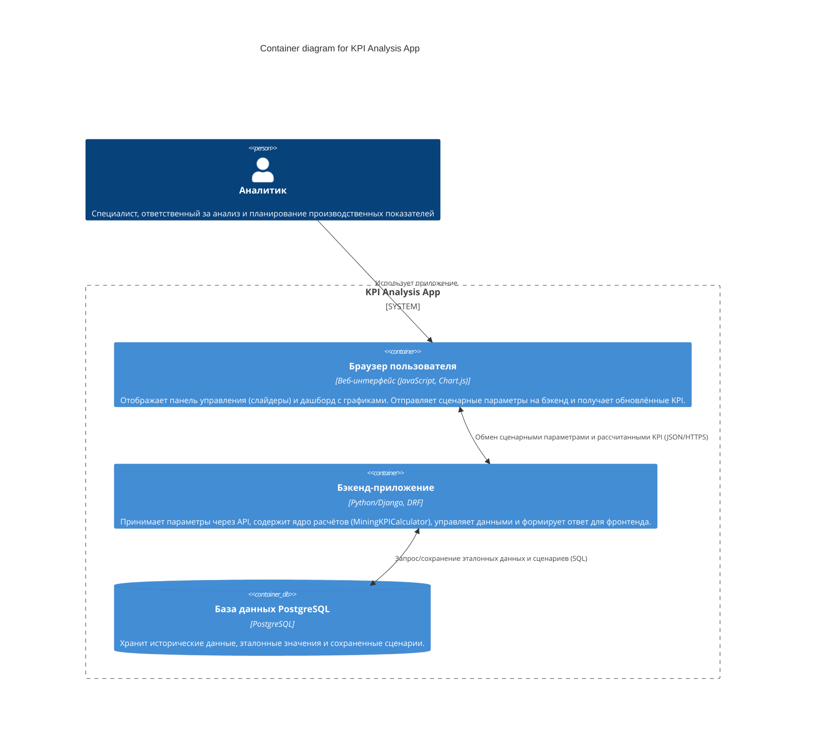
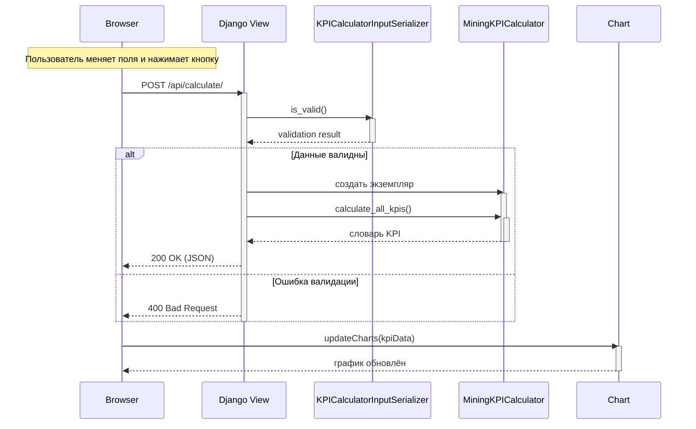

# KPI Analysis App

Django-приложение для расчёта и визуализации ключевых показателей эффективности (KPI) в горнодобывающей отрасли.

## Содержание
- [О приложении](#о-приложении)
- [Архитектура системы](#архитектура-системы)
  - [Диаграмма C4](#диаграмма-c4)
  - [Диаграмма последовательности (процесс расчёта KPI)](#диаграмма-последовательности-процесс-расчёта-kpi)
- [Как запустить приложение](#как-запустить-приложение)
- [Стек технологий](#стек-технологий)

## О приложении

Приложение позволяет горному инженеру (аналитику) изменять входные параметры (объём добычи, время простоев, численность бригады, расход топлива) и мгновенно видеть пересчитанные KPI: коэффициент использования оборудования, производительность труда, удельный расход топлива, фактический темп добычи. Все расчёты выполняются на бэкенде, а графики обновляются без перезагрузки страницы.

## Архитектура системы

### Диаграмма C4
На диаграмме ниже показаны основные контейнеры приложения и их взаимодействие.



### Диаграмма последовательности (процесс расчёта KPI)



## Как запустить приложение
**Требования**: Docker и Docker Compose (или Docker Desktop).

1. Склонируйте репозиторий и перейдите в папку проекта:
   ```bash
   git clone https://gitverse.ru/ваш-логин/kpi-analysis-app.git
   cd kpi-analysis-app
   ```
2. Скопируйте `.env.example` в `.env` (при необходимости отредактируйте переменные).  

3. Запустите контейнеры:
   ```bash
   docker-compose up --build
   ```
4. Откройте в браузере: http://localhost:8000/simulator/


>  **Примечание:** При первом запуске может потребоваться несколько минут на загрузку Docker-образов. После успешного запуска приложение будет доступно по указанному адресу.

## Стек технологий
- Python 3.13 / Django 4.x
- Django REST Framework
- PostgreSQL
- Docker / Docker Compose
- Chart.js (фронтенд)